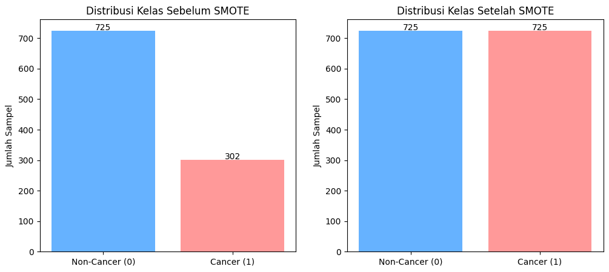
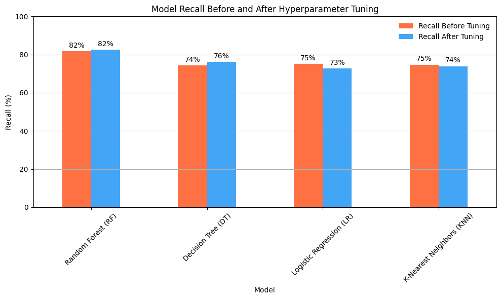

# Laporan Proyek Machine Learning - Ni Gusti Putu Saniskalita Desniari

## Domain Proyek


Kanker merupakan salah satu penyebab utama kematian di dunia. Menurut laporan dari World Health Organization (WHO), terdapat sekitar 10 juta kematian akibat kanker pada tahun 2020 [1]. Deteksi dini kanker memiliki dampak yang signifikan terhadap keberhasilan pengobatan dan keselamatan pasien. Oleh karena itu, penggunaan teknologi modern seperti machine learning (ML) dalam mendeteksi dan memprediksi kanker menjadi sangat penting.

Beberapa penelitian menunjukkan bahwa algoritma machine learning mampu mengenali pola-pola kompleks dalam data medis yang tidak mudah dikenali oleh manusia. Kourou et al. menyatakan bahwa metode pembelajaran mesin seperti logistic regression, decision tree, random forest, dan support vector machine telah digunakan secara luas dalam prognosis dan prediksi kanker dengan hasil yang menjanjikan [2]. Selain itu, penggunaan machine learning terbukti dapat meningkatkan efisiensi serta akurasi sistem pendukung keputusan medis [3].

Dataset “Cancer Prediction Dataset” dari Kaggle menyediakan fitur-fitur seperti usia, jenis kelamin, riwayat merokok, dan indikator medis lainnya, yang dapat dimanfaatkan untuk membangun model klasifikasi guna memprediksi risiko kanker. Analisis terhadap dataset ini dapat memberikan wawasan berharga dalam pengembangan sistem prediksi kanker yang lebih efisien dan akurat, terutama pada tahap deteksi awal.

Masalah prediksi kanker menjadi sangat penting karena:
- Deteksi dini menyelamatkan nyawa: Keberhasilan pengobatan kanker meningkat secara signifikan jika penyakit ini dapat dideteksi pada tahap awal [1].
- Kekurangan tenaga spesialis: Banyak wilayah, terutama di negara berkembang, masih terdapat keterbatasan akses terhadap tenaga medis ahli, sehingga sistem prediktif otomatis sangat dibutuhkan [4].
- Efisiensi dan akurasi: Pendekatan berbasis data dapat membantu membuat keputusan medis yang lebih cepat dan tepat serta mengurangi kesalahan manusia dalam diagnosa [3][5].

Dengan memanfaatkan pendekatan machine learning yang tepat, kita dapat membangun sistem prediksi yang tidak hanya akurat tetapi juga terukur, transparan, dan dapat diandalkan dalam praktik klinis.

## Business Understanding

### Problem Statements
Berdasarkan uraian yang telah dipaparkan pada latar belakang di atas, maka rumusan masalah dari proyek ini adalah sebagai berikut:
- Bagaimana cara memprediksi apakah seseorang menderita kanker hanya dengan menggunakan data medis dasar seperti usia, jenis kelamin, riwayat merokok, dan hasil pemeriksaan laboratorium (misalnya jumlah sel darah putih, hemoglobin, dan kadar hormon)?
- Dari serangkaian fitur medis yang tersedia, fitur apa yang paling berpengaruh terhadap diagnosis kanker?
- Bagaimana cara mengukur dan meningkatkan kinerja model prediksi kanker agar dapat digunakan secara efektif dalam sistem pendukung keputusan medis?

### Goals
Berdasarkan rumusan masalah di atas, tujuan dari proyek ini adalah:
- Membangun model klasifikasi berbasis machine learning untuk memprediksi status kanker (positif/negatif) berdasarkan data medis dasar yang tersedia.
- Mengidentifikasi fitur-fitur medis yang memiliki pengaruh paling besar terhadap hasil prediksi kanker.
- Meningkatkan performa model dengan mengoptimalkan parameter-parameter model (hyperparameter tuning) serta mengevaluasinya menggunakan metrik klasifikasi yang relevan, seperti akurasi, precision, recall, dan F1-score.

### Solution statements
Berdasarkan tujuan yang telah dipaparkan di atas, maka proyek penelitian ini memiliki solusi atau tahapan sebagai berikut:
- Menggunakan beberapa algoritma machine learning, seperti Logistic Regression, Decision Trees, Random Forest, dan K-Nearest Neighbors untuk membangun model klasifikasi kanker yang dapat memprediksi status kanker berdasarkan data medis yang tersedia. Pendekatan ini memungkinkan perbandingan performa antar algoritma dalam mengidentifikasi pasien dengan risiko kanker, sehingga dapat dipilih satu model terbaik berdasarkan hasil evaluasi yang paling optimal.
- Melakukan eksplorasi data awal (Exploratory Data Analysis / EDA) untuk menganalisis korelasi antar fitur, mengidentifikasi hubungan antara variabel medis (seperti usia, jumlah sel darah putih, hemoglobin, dan kadar hormon) dengan status kanker, serta menentukan fitur mana yang memiliki kontribusi signifikan dalam mendeteksi kanker. Tahapan ini penting untuk memahami pola dalam data, membersihkan data dari anomali atau nilai kosong, serta memperkuat proses seleksi fitur sebelum masuk ke tahap pemodelan.
- Menerapkan hyperparameter tuning dengan menggunakan teknik Grid Search untuk memilih kombinasi parameter terbaik pada masing-masing algoritma dan meningkatkan kinerja model prediksi kanker. Model akan dievaluasi menggunakan metrik seperti akurasi, precision, recall, dan F1-score, yang akan membantu dalam menilai kualitas prediksi serta memastikan model mampu menangani ketidakseimbangan data dan meminimalkan kesalahan klasifikasi, terutama false negatives yang kritis dalam diagnosis kanker.

## Data Understanding
| Jenis          | Keterangan                                                                                            |
| -------------- | ----------------------------------------------------------------------------------------------------- |
| **Title**      | [Cancer Prediction Dataset](https://www.kaggle.com/datasets/rabieelkharoua/cancer-prediction-dataset) |
| **Source**     | [Kaggle](https://www.kaggle.com)                                                                      |
| **Maintainer** | [Rabie El Kharoua](https://www.kaggle.com/rabieelkharoua)                                             |
| **License**    | Unknown                                                                                               |
| **Visibility** | Publik                                                                                                |
| **Tags**       | Cancer, Classification, Health, Medical                                                               |
| **Usability**  | 7.75                                                                                                  |
 
Dataset yang digunakan dalam proyek ini adalah Cancer Prediction Dataset yang tersedia secara publik di platform Kaggle. Dataset ini berisi informasi medis dan gaya hidup dari 1500 pasien, yang dirancang untuk memprediksi keberadaan kanker berdasarkan sejumlah fitur. Dataset ini disusun untuk mencerminkan tantangan nyata dalam pemodelan prediktif di bidang medis.

### Variabel-variabel pada Cancer dataset adalah sebagai berikut:
| # | Column            | Dtype    |
|---|-------------------|----------|
| 0 | Age               | int64    |
| 1 | Gender            | int64    |
| 2 | BMI               | float64  |
| 3 | Smoking           | int64    |
| 4 | GeneticRisk       | int64    |
| 5 | PhysicalActivity  | float64  |
| 6 | AlcoholIntake     | float64  |
| 7 | CancerHistory     | int64    |
| 8 | Diagnosis         | int64    |

Dataset ini terdiri dari beberapa fitur penting yang mewakili karakteristik pasien:
- Age: Usia pasien dalam rentang 20 hingga 80 tahun.
- Gender: Jenis kelamin pasien, di mana 0 menunjukkan laki-laki dan 1 menunjukkan perempuan.
- BMI: Indeks massa tubuh pasien (Body Mass Index) dengan nilai kontinu antara 15 hingga 40.
- Smoking: Status merokok pasien, di mana 0 berarti tidak merokok dan 1 berarti merokok.
- GeneticRisk: Risiko genetik terhadap kanker, dikategorikan sebagai 0 (Low), 1 (Medium), dan 2 (High).
- PhysicalActivity: Jumlah jam aktivitas fisik per minggu, berkisar antara 0 hingga 10 jam.
- AlcoholIntake: Jumlah konsumsi alkohol per minggu, dalam satuan unit (0–5).
- CancerHistory: Riwayat pribadi pasien terhadap kanker, 0 menunjukkan tidak ada riwayat dan 1 menunjukkan ada riwayat kanker.
- Diagnosis: Variabel biner sebagai target klasifikasi, di mana 0 menunjukkan pasien tidak menderita kanker dan 1 menunjukkan pasien menderita kanker.

### Pengecekan Missing Value
  Langkah awal dalam pra-pemrosesan data adalah memeriksa keberadaan missing values pada setiap fitur dalam dataset Cancer Prediction. Jika ditemukan nilai yang hilang pada fitur-fitur penting seperti usia, BMI, atau riwayat kanker, maka penanganan dilakukan melalui imputasi menggunakan nilai median atau mean untuk fitur numerik. Namun, jika jumlah data yang hilang sangat sedikit, baris yang mengandung missing values dapat dihapus tanpa memengaruhi kualitas keseluruhan dataset. Penanganan nilai yang hilang sangat penting karena dapat menurunkan performa model dan menimbulkan bias prediksi. Dengan melakukan imputasi atau penghapusan data yang tidak lengkap, dataset menjadi lebih bersih dan konsisten, sehingga model machine learning dapat belajar dan membuat prediksi dengan lebih akurat.

  Untuk pengecekan missing values, kode berikut digunakan:
  ```python
  # Memeriksa missing value
  df.isnull().sum()
  ```
  
  
  Namun, dalam dataset ini, saat dilakukan pengecekan tidak terdapat missing value sehingga tidak diperlukan penanganan missing value.

### Pengecekan Data Duplikat
  Langkah berikutnya adalah memeriksa apakah terdapat data duplikat dalam dataset. Data duplikat bisa muncul karena kesalahan dalam proses pengumpulan atau entri data, yang dapat mempengaruhi kualitas analisis dan hasil prediksi.
  Untuk pengecekan data duplikat, kode berikut digunakan:
  ```python
  # Memeriksa duplikasi data
  jumlah_duplikat = df.duplicated().sum()
    print(f"Jumlah baris duplikat: {jumlah_duplikat}")
  ```
  Saat dilakukan pengecekan tidak terdapat data yang duplikat pada dataset.

### Pengecekan Deskripsi Statistik
  Langkah berikutnya adalah mengecek deskripsi statistik untuk kolom numerik dalam DataFrame guna memahami karakteristik dasar dari data. Informasi ini mencakup nilai minimum, maksimum, rata-rata (mean), kuartil (25%, 50%, 75%), serta standar deviasi dari setiap fitur numerik. Dengan analisis ini, kita dapat mengidentifikasi apakah terdapat nilai ekstrem (outliers), distribusi yang tidak seimbang, atau ketidakwajaran pada data. Hasil deskripsi statistik ini juga dapat digunakan sebagai dasar untuk proses normalisasi atau transformasi data sebelum model machine learning dibangun. Untuk pengecekan deskripsi statistik, kode berikut digunakan:
  ```python
  # Memeriksa deskripsi statistik
  df.describe()
  ```
  
  
  Berdasarkan hasil deskripsi statistik, kolom Gender dan Diagnosis memiliki distribusi yang relatif seimbang antara dua kelas, dengan rata-rata mendekati nilai tengah dari domain biner (sekitar 0.49 dan 0.37). Sementara itu, fitur numerik seperti Age, BMI, PhysicalActivity, dan AlcoholIntake menunjukkan variabilitas yang cukup besar, yang tercermin dari nilai standar deviasi yang tinggi. Hal ini menunjukkan adanya keragaman kondisi kesehatan dan gaya hidup individu dalam dataset, yang wajar mengingat data mencakup pasien dengan berbagai latar belakang dan tingkat risiko kanker. Informasi ini penting untuk dipertimbangkan dalam proses pemodelan, terutama dalam hal normalisasi data dan identifikasi outlier.

## Exploratory Data Analysis
### Visualisasi Data Kolom Numerik
  
  
  Berdasarkan analisis distribusi histogram, fitur-fitur dalam dataset menunjukkan karakteristik yang beragam. Usia pasien (Age) tersebar dari 20 hingga 80 tahun dengan konsentrasi di usia 40–60 tahun, mencerminkan kelompok risiko yang lebih tinggi. Distribusi Gender (0 = laki-laki, 1 = perempuan) tampak seimbang, sedangkan BMI (15–40) menunjukkan pola normal dengan mayoritas individu berada dalam kisaran sehat hingga overweight. Fitur-fitur seperti Smoking, CancerHistory, dan GeneticRisk cenderung tidak seimbang karena didominasi oleh kategori non-perokok, tanpa riwayat kanker, dan risiko genetik rendah. Distribusi PhysicalActivity (0–10 jam/minggu) dan AlcoholIntake (0–5 unit/minggu) relatif merata, mencerminkan variasi gaya hidup yang cukup luas. Sementara itu, fitur target Diagnosis (0 = tidak kanker, 1 = kanker) menunjukkan bahwa sebagian besar pasien tidak terdiagnosis kanker, namun distribusinya masih cukup proporsional untuk keperluan klasifikasi biner. Variasi distribusi ini penting diperhatikan dalam tahap pra-pemrosesan dan pelatihan model untuk memastikan representasi yang seimbang dan akurat.

### Visualisasi Distribusi Kelas
  
  
  Berdasarkan analisis distribusi menggunakan pie chart, diperoleh informasi bahwa proporsi pasien yang terdiagnosis kanker (ditandai dengan warna pink) sebanyak 557 orang atau sekitar 37,1%, sedangkan pasien yang tidak menderita kanker (ditandai dengan warna hijau muda) berjumlah 943 orang atau sekitar 62,9%. Visualisasi ini memberikan pemahaman mengenai keseimbangan distribusi kelas pada variabel target dalam dataset.

### Analisis Distribusi dan Statistik Deskriptif
  

  Berdasarkan analisis distribusi pasien berdasarkan diagnosis kanker dan jenis kelamin, ditemukan bahwa kasus kanker lebih banyak terjadi pada perempuan (364 orang) dibandingkan laki-laki (193 orang), sementara jumlah pasien non-kanker didominasi oleh laki-laki (571 orang) dibandingkan perempuan (372 orang). Secara keseluruhan, terdapat 557 pasien yang terdiagnosis kanker dari total 1500 data. Selain itu, rata-rata usia pasien yang terdiagnosis kanker adalah 54,83 tahun, yang mengindikasikan bahwa kanker lebih banyak ditemukan pada kelompok usia dewasa hingga lanjut usia. Temuan ini memberikan gambaran mengenai distribusi kasus kanker berdasarkan gender dan usia dalam dataset.

### Visualisasi Distribusi Fitur
  

  Berdasarkan visualisasi, fitur Smoking, CancerHistory, Age, PhysicalActivity, dan AlcoholIntake menunjukkan perbedaan distribusi yang jelas antara pasien dengan dan non kanker, menandakan pengaruh kuat terhadap Diagnosis. Sementara GeneticRisk dan BMI juga berkontribusi, namun pengaruhnya terlihat lebih lemah dibanding fitur lainnya.

### Analisis Korelasi
  

  Berdasarkan matriks korelasi pada dataset Cancer Prediction, variabel CancerHistory memiliki korelasi tertinggi dengan Diagnosis sebesar 0.39, menunjukkan bahwa riwayat kanker sangat berpengaruh dalam menentukan diagnosis. Selain itu, variabel seperti GeneticRisk, Gender, moking, AlcoholIntake, dan Age juga menunjukkan korelasi positif lemah hingga sedang (sekitar 0.19 hingga 0.25), yang berarti faktor-faktor tersebut turut berkontribusi terhadap risiko kanker. Di sisi lain, PhysicalActivity memiliki korelasi negatif sebesar -0.15, mengindikasikan bahwa semakin aktif secara fisik, kemungkinan untuk terkena kanker cenderung menurun. Meskipun korelasi antar fitur umumnya lemah, seluruh fitur tetap dipertahankan dalam analisis guna memastikan informasi yang cukup tersedia untuk proses pemodelan dan prediksi.

### Deteksi dan Penanganan Outlier
  

  Berdasarkan visualisasi boxplot menggambarkan adanya nilai-nilai ekstrem (outlier) pada sebagian besar fitur dalam dataset. Kehadiran outlier ini berpotensi memengaruhi kinerja model prediktif, sehingga perlu ditangani dengan cermat. 
  Setelah dilakukan deteksi dan pembersihan menggunakan metode Interquartile Range (IQR), data menjadi lebih bersih dan siap digunakan untuk proses analisis dan pemodelan lebih lanjut.

  
  
  Setelah dilakukan penanganan, fitur-fitur dalam dataset menunjukkan distribusi yang lebih konsisten dan stabil, dengan berkurangnya jumlah nilai pencilan (outlier) yang ekstrem.

## Data Preparation
Fitur pada Dataset Cancer Prediction sudah berbentuk numerik semua  sehingga tidak diperlukan proses encoding. Adapun tahapan preprocessing yang dilakukan meliputi:

- **Data Splitting**
  Dataset dibagi menjadi dua bagian, yaitu data pelatihan (training) dan data pengujian (testing) dengan proporsi 80:20. Data pelatihan digunakan untuk membangun dan melatih model, sementara data pengujian digunakan untuk mengevaluasi kinerja model terhadap data yang belum pernah dilihat sebelumnya. Pembagian ini penting untuk mencegah overfitting dan memastikan bahwa performa model dapat diuji secara adil. Proses pembagian dilakukan dengan stratifikasi agar distribusi kelas target tetap seimbang di kedua subset.

  Berikut adalah jumlah data setelah dilakukan splitting:

  | Data             | Jumlah |
  | ---------------- | ------ |
  | Data Keseluruhan | 1500   |
  | Data Train       | 1027   |
  | Data Test        | 257    |

  Distribusi kelas setelah pembagian:
  * Data Train: 725 non-cancer, 302 cancer
  * Data Test: 182 non-cancer, 75 cancer

- **Penanganan Imbalanced Classes**
  Mengingat adanya ketidakseimbangan kelas pada variabel target (lebih banyak individu yang tidak menderita kanker), teknik seperti SMOTE (Synthetic Minority Over-sampling Technique) dapat diterapkan untuk menghasilkan lebih banyak sampel dari kelas minoritas (Cancer) dan memastikan model tidak bias terhadap kelas mayoritas (Non-Cancer). Teknik SMOTE membantu meningkatkan representasi kelas minoritas dengan membuat sampel sintetis, sehingga model dapat belajar lebih baik dan lebih adil dalam memprediksi kedua kelas. Ketidakseimbangan kelas dapat menyebabkan model cenderung memprediksi kelas mayoritas dan mengabaikan kelas minoritas, sehingga penanganan masalah ini sangat penting untuk menghasilkan model yang lebih akurat.

  Berikut adalah perbandingan distribusi kelas sebelum dan setelah diterapkannya SMOTE:
  

  * **Sebelum SMOTE**: Data pelatihan memiliki distribusi yang tidak seimbang, dengan lebih banyak sampel dari kelas Non-Cancer (725) dibandingkan dengan kelas Cancer (302).
  * **Setelah SMOTE**: Teknik SMOTE menghasilkan distribusi yang lebih seimbang, dengan jumlah sampel untuk kedua kelas menjadi hampir sama.

- **Standarisasi**
  Proses standarisasi bertujuan untuk menyamakan rentang nilai pada setiap fitur dalam dataset, sehingga setiap fitur berada pada skala yang serupa. Tanpa standarisasi, fitur dengan nilai yang lebih besar akan mendominasi hasil prediksi, sementara fitur dengan nilai yang lebih kecil akan memiliki pengaruh yang lebih rendah terhadap prediksi. Dalam proyek ini, standarisasi dilakukan menggunakan metode StandardScaler() dari library sklearn, yang bekerja dengan mengurangi setiap nilai pada fitur dengan rata-rata fitur (mean), kemudian membagi hasilnya dengan standar deviasi. Metode ini sangat cocok digunakan karena distribusi data dalam dataset ini cenderung mendekati normal, yang membuat standarisasi menjadi pilihan yang lebih baik.

  Untuk menghindari kebocoran informasi pada data uji, standarisasi hanya diterapkan pada data latih. Berikut adalah contoh data setelah dilakukan standarisasi pada dataset pelatihan:
  

  Dengan standarisasi, semua fitur berada dalam skala yang serupa, memungkinkan model machine learning untuk memproses data secara lebih efektif tanpa bias terhadap fitur dengan rentang nilai yang lebih besar.

## Modeling
Pada tahap ini, beberapa algoritma machine learning diterapkan untuk menyelesaikan masalah klasifikasi kanker, yakni **Random Forest (RF)**, **Decision Trees (DT)**, **Logistic Regression (LR)**, dan **K-Nearest Neighbors (KNN)**.

Pada awalnya, model-model dasar seperti **RandomForestClassifier, DecisionTreeClassifier, LogisticRegression, dan KNeighborsClassifier** dilatih menggunakan **parameter default** masing-masing model. Pelatihan ini dilakukan pada **data training yang telah diskalakan dan di-resample** (X\_train\_scaled dan y\_train\_resampled), tanpa melakukan modifikasi pada parameter model. Tujuan dari tahap ini adalah untuk mendapatkan **kinerja dasar** model sebelum dilakukan optimasi parameter.

Setelah model-model tersebut dilatih, langkah selanjutnya adalah melakukan **hyperparameter tuning** untuk mencari kombinasi parameter terbaik yang dapat meningkatkan kinerja model. Proses ini dilakukan menggunakan **GridSearchCV**, yang akan mengeksplorasi berbagai kombinasi nilai parameter untuk masing-masing model dan memilih yang memberikan hasil terbaik.

Setelah menemukan parameter terbaik, model akan dibangun kembali dengan menggunakan kombinasi parameter tersebut dan diuji untuk mengevaluasi apakah ada peningkatan performa dibandingkan dengan model yang dilatih menggunakan parameter default.

Berikut adalah penjelasan dari model yang digunakan:

### 1. **Random Forest (RF)**


**Random Forest** adalah algoritma ensemble yang membangun banyak pohon keputusan dan menggabungkan prediksinya untuk meningkatkan akurasi serta mengurangi overfitting. Sebagaimana dijelaskan oleh Scikit-learn, Random Forest menggunakan beberapa pohon keputusan yang dilatih pada berbagai subset data, dan hasil prediksi akhir diperoleh melalui mayoritas suara dari seluruh pohon yang ada [6].

Model ini dilatih menggunakan data hasil praproses X_train_prepared dan target y_train_resampled, yang telah di-resample untuk mengatasi ketidakseimbangan kelas.

Berikut adalah kode pelatihan model:

Berikut adalah kode pelatihan model.
```python
rf = RandomForestClassifier().fit(X_train_prepared, y_train_resampled)
```
Selanjutnya, evaluasi dilakukan pada data X_test_prepared dengan berbagai metrik seperti accuracy, precision, recall, f1-score, serta visualisasi confusion matrix.

**Tahapan:**
- Data dilatih melalui proses ensemble, di mana setiap pohon dilatih dengan subset acak dari data pelatihan.
- Pada setiap node, fitur yang digunakan dipilih secara acak untuk meningkatkan keragaman antar pohon.
- Saat prediksi, Random Forest menggunakan mayoritas suara (majority voting) dari seluruh pohon untuk menentukan hasil akhir.
- Untuk optimasi performa, dilakukan pencarian parameter terbaik menggunakan GridSearchCV

**Parameter yang Digunakan:**
- `n_estimators`: Jumlah pohon yang akan dibuat.
- `max_depth`: Kedalaman maksimum setiap pohon keputusan.
- `min_samples_split`: Jumlah minimum sampel untuk membagi node internal.

**Kelebihan & Kekurangan RF:**
| **Kelebihan**                                                     | **Kekurangan**                                                       |
| ----------------------------------------------------------------- | -------------------------------------------------------------------- |
| Mengurangi overfitting dibandingkan model decision tree tunggal   | Waktu pelatihan lebih lama, terutama dengan jumlah pohon yang besar  |
| Cocok untuk dataset besar dan kompleks                            | Kurang interpretatif dibanding model sederhana seperti decision tree |
| Memberikan informasi penting tentang fitur (*feature importance*) |                                                                      |
| Dapat digunakan untuk prediksi klasifikasi maupun regresi         |                                                                      |

### 2. **Decision Tree (DT)**


**Decision Tree** adalah algoritma pembelajaran yang membangun model berbentuk pohon keputusan, yang dapat digunakan untuk masalah klasifikasi maupun regresi. Setiap node pada pohon keputusan mewakili suatu fitur yang dipilih, dan cabang mewakili keputusan yang diambil berdasarkan nilai dari fitur tersebut.

**Tahapan:**
Proses pembangunan pohon keputusan dimulai dengan memilih fitur yang membagi dataset terbaik, yaitu fitur yang dapat memisahkan data dengan cara paling optimal menggunakan kriteria seperti Gini Impurity atau Entropy. Pembagian ini dilakukan secara berulang pada setiap node pohon, sehingga dataset terpecah menjadi subset yang lebih homogen. Proses ini terus berlanjut hingga mencapai batas kedalaman pohon yang telah ditentukan, atau hingga tidak ada pembagian yang lebih baik lagi. Kedalaman pohon, jumlah minimum sampel di setiap node, atau jumlah minimum sampel untuk pembagian dapat menjadi kriteria penghentian dalam proses pembangunan pohon [7].

Berikut adalah kode pelatihan model Decision Tree menggunakan dataset yang telah dipersiapkan:
```python
dt = DecisionTreeClassifier().fit(X_train_prepared, y_train_resampled)
```

**Parameter yang Digunakan:**
- `criterion`: Menentukan metode untuk mengukur kualitas pemisahan node.
- `max_depth`: Menentukan kedalaman maksimal pohon. 
- `min_samples_split`: Menentukan jumlah minimum sampel yang dibutuhkan untuk membagi node.

**Kelebihan & Kekurangan DT:**
| **Kelebihan**                                  | **Kekurangan**                                                                                |
| ---------------------------------------------- | --------------------------------------------------------------------------------------------- |
| Mudah dipahami dan diinterpretasikan.          | Rentan terhadap **overfitting**, terutama jika pohon terlalu dalam.                           |
| Cepat dalam proses pelatihan dan prediksi.     | Tidak stabil pada data yang banyak mengandung noise.                                          |
| Dapat menangani fitur numerik dan kategorikal. | Cenderung menghasilkan model yang kurang robust pada dataset yang sangat besar atau kompleks. |

### 3. **Logistic Regression (LR)**


**Logistic Regression** merupakan salah satu metode statistik yang sering digunakan dalam tugas klasifikasi biner. Model ini memperkirakan probabilitas sebuah data termasuk dalam kelas tertentu dengan memanfaatkan fungsi logistik (sigmoid).

Kode pelatihan model yang digunakan adalah sebagai berikut:
```python
lr = LogisticRegression().fit(X_train_prepared, y_train_resampled)
```

**Tahapan:**
Logistic Regression bekerja dengan pertama-tama menghitung gabungan linier dari fitur-fitur input, yaitu mengalikan setiap fitur dengan bobot yang dipelajari dan menjumlahkannya. Hasil perhitungan ini kemudian dimasukkan ke dalam fungsi sigmoid, yang mengkonversi nilai tersebut menjadi angka antara 0 dan 1. Angka ini ditafsirkan sebagai probabilitas bahwa data masuk ke dalam kelas tertentu. Bila probabilitas lebih besar dari ambang batas (umumnya 0.5), maka data diklasifikasikan sebagai kelas positif, sebaliknya sebagai kelas negatif [8].

**Parameter yang Digunakan:**
- `penalty`: Menentukan jenis regulasi yang digunakan untuk menghindari overfitting, misalnya L1 (Lasso) atau L2 (Ridge).
- `C`: Parameter regulasi yang mengontrol kekuatan penalti. Nilai lebih kecil menandakan regulasi yang lebih kuat.
- `solver`: Algoritma optimasi yang digunakan dalam proses pelatihan, seperti liblinear (untuk dataset kecil) dan saga (mendukung L1 & L2 untuk dataset besar).

**Kelebihan & Kekurangan LR:**
| **Kelebihan**                                                            | **Kekurangan**                                                              |
| ------------------------------------------------------------------------ | --------------------------------------------------------------------------- |
| Proses pelatihan dan prediksi berlangsung cepat.                         | Tidak mampu menangani data dengan hubungan non-linier yang kompleks.        |
| Memberikan hasil dalam bentuk probabilitas, cocok untuk analisis risiko. | Sensitif terhadap skala fitur; perlu normalisasi atau standarisasi data.    |
| Sederhana dan mudah diinterpretasikan.                                   | Performa dapat menurun pada dataset dengan banyak fitur saling berkorelasi. |

### 4. **K-Nearest Neighbors (KNN)**


**K-Nearest Neighbors (KNN)** merupakan algoritma klasifikasi non-parametrik yang bekerja dengan cara menentukan label suatu data uji berdasarkan mayoritas label dari sejumlah k data latih terdekat. Penentuan kedekatan umumnya dilakukan dengan menghitung jarak menggunakan metrik seperti Euclidean atau Manhattan.

Dalam proyek ini, model KNN dilatih pada data yang telah diproses menggunakan kode berikut:
```python
knn = KNeighborsClassifier().fit(X_train_prepared, y_train_resampled)
```
**Tahapan:**
**K-Nearest Neighbors (KNN)** merupakan algoritma klasifikasi yang menentukan kelas suatu data berdasarkan kemiripannya dengan data lain dalam himpunan pelatihan. Proses klasifikasi dimulai dengan menghitung jarak antara data yang ingin diprediksi terhadap seluruh data pada training set. Jarak ini umumnya diukur menggunakan metrik seperti Euclidean Distance, yang menggambarkan sejauh mana dua titik data berada satu sama lain. Setelah semua jarak dihitung, algoritma akan memilih sejumlah k data terdekat dan menentukan kelas berdasarkan mayoritas label dari tetangga-tetangga tersebut. Dengan kata lain, kelas yang paling sering muncul dari k tetangga terdekat akan digunakan sebagai hasil prediksi. Karena model ini mengandalkan kedekatan data, nilai k yang terlalu kecil dapat membuat prediksi sangat sensitif terhadap fluktuasi lokal pada data [9].

**Parameter yang Digunakan:**
- `n_neighbors`: Menentukan jumlah tetangga terdekat yang akan digunakan dalam prediksi.
- `weights`: Menentukan bobot masing-masing tetangga (uniform atau distance)
- `metric`: Jenis metrik jarak yang digunakan (misalnya, Euclidean atau Manhattan).

**Kelebihan & Kekurangan KNN:**
| Kelebihan                                                               | Kekurangan                                                                                           |
| ----------------------------------------------------------------------- | ---------------------------------------------------------------------------------------------------- |
| Implementasi sederhana dan mudah dipahami.                              | Lambat saat melakukan prediksi pada dataset besar karena harus menghitung jarak ke semua titik data. |
| Tidak memerlukan model eksplisit atau pelatihan berbasis parameter.     | Tidak efektif pada dataset berdimensi tinggi karena efek “curse of dimensionality”.                  |
| Cocok untuk klasifikasi dengan data non-linier dan distribusi kompleks. | Sangat sensitif terhadap data yang tidak relevan atau outlier.                                       |

### Hyperparameter Tuning
Untuk mengoptimalkan performa model, dilakukan proses **hyperparameter tuning** guna menemukan kombinasi parameter terbaik. Teknik yang digunakan adalah GridSearchCV, yang secara sistematis menguji berbagai kemungkinan nilai parameter dan memilih konfigurasi yang menghasilkan kinerja terbaik.

Berikut adalah parameter yang digunakan untuk pelatihan tiap model hasil dari hyperparameter tuning


### Pemilihan Model Terbaik
Berdasarkan hasil evaluasi terhadap dataset *cancer prediction*, **Random Forest (RF)** menjadi pilihan model terbaik dibandingkan model lainnya seperti Decision Tree, Logistic Regression, dan K-Nearest Neighbors. Model ini menunjukkan performa yang paling konsisten dan unggul pada berbagai metrik evaluasi seperti akurasi, precision, recall, dan F1-score.

Random Forest memiliki kemampuan dalam menangani hubungan non-linier antar fitur dan secara efektif mengurangi risiko overfitting melalui pendekatan ensemble. Model ini juga mampu memberikan informasi penting mengenai kontribusi masing-masing fitur terhadap prediksi, yang sangat berguna untuk analisis lebih lanjut. Meskipun demikian, penting untuk terus memperhatikan hasil evaluasi guna memastikan model tetap optimal dalam berbagai kondisi data.

## Evaluation
Pada tahap ini, metrik evaluasi yang digunakan untuk mengukur performa model meliputi **Akurasi**, **Precision**, **Recall**, dan **F1-Score**. Metrik-metrik ini dipilih karena sangat relevan dalam konteks permasalahan klasifikasi biner pada proyek ini, yaitu memprediksi apakah seseorang menderita kanker atau tidak. Penggunaan metrik ini penting untuk memastikan bahwa model tidak hanya sekadar akurat secara umum, tetapi juga mampu mengenali kasus positif (penderita kanker) dengan baik, terutama karena kesalahan dalam klasifikasi positif dapat berdampak serius dalam konteks medis.

Dengan metrik ini, kita dapat mengevaluasi seberapa efektif model dalam mengidentifikasi pasien yang benar-benar memiliki kanker berdasarkan fitur-fitur medis dasar seperti usia, jenis kelamin, kebiasaan merokok, dan hasil pemeriksaan laboratorium. Selain itu, metrik ini juga membantu dalam mengukur dan meningkatkan kinerja model agar dapat digunakan secara efektif sebagai bagian dari sistem pendukung keputusan medis.

**1. Akurasi**

Akurasi adalah metrik yang mengukur seberapa banyak prediksi yang benar dibandingkan dengan total prediksi yang dilakukan oleh model. Dalam konteks prediksi kanker, akurasi mengukur sejauh mana model dapat memprediksi apakah pasien benar-benar mengidap kanker atau tidak. Rumusnya:


$$
\text{Akurasi} = \frac{\text{True Positives (TP)} + \text{True Negatives (TN)}}{\text{Total Observations (TP + TN + FP + FN)}}
$$

Dalam konteks evaluasi model klasifikasi, **True Positives (TP)** merujuk pada kasus positif yang benar, yaitu individu yang benar-benar mengidap kanker dan diprediksi sebagai positif oleh model. **True Negatives (TN)** adalah kasus negatif yang benar, yaitu individu yang sehat dan diprediksi negatif oleh model. Sebaliknya, **False Positives (FP)** terjadi ketika individu yang sehat salah diprediksi mengidap kanker, sementara **False Negatives (FN)** adalah individu yang mengidap kanker tetapi salah diprediksi sehat oleh model. Metrik evaluasi seperti akurasi, precision, recall, dan F1-score dihitung berdasarkan jumlah TP, TN, FP, dan FN ini.

**2. Precision**

Precision mengukur seberapa banyak prediksi positif yang benar dibandingkan dengan seluruh prediksi positif yang dibuat oleh model. Dalam hal ini, precision mengukur seberapa banyak prediksi pasien mengidap kanker yang benar-benar mengidap kanker. Rumusnya:

$$
\text{Precision} = \frac{\text{True Positives (TP)}}{\text{True Positives (TP)} + \text{False Positives (FP)}}
$$

Precision yang tinggi berarti model sangat tepat dalam memprediksi pasien yang benar-benar mengidap kanker, dengan sedikit kesalahan dalam mengklasifikasikan pasien yang sehat sebagai pasien kanker.

**3. Recall**

Recall mengukur seberapa banyak kasus positif yang sebenarnya dapat dideteksi oleh model. Dalam konteks prediksi kanker, recall mengukur kemampuan model untuk mengidentifikasi semua pasien yang benar-benar mengidap kanker. Rumusnya:

$$
\text{Recall} = \frac{\text{True Positives (TP)}}{\text{True Positives (TP)} + \text{False Negatives (FN)}}
$$

Recall yang tinggi berarti model berhasil mendeteksi sebagian besar pasien yang benar-benar mengidap kanker. Ini penting dalam konteks medis, karena lebih baik untuk mendeteksi semua kasus kanker meskipun ada beberapa kesalahan (false positives).

**4. F1-Score**

F1-Score adalah rata-rata harmonis antara Precision dan Recall, memberikan keseimbangan antara keduanya. F1-Score sangat berguna ketika kita ingin memastikan bahwa model tidak hanya akurat dalam memprediksi positif, tetapi juga mampu menangkap sebagian besar kasus positif. Rumusnya:

$$
\text{F1-Score} = 2 \times \frac{\text{Precision} \times \text{Recall}}{\text{Precision} + \text{Recall}}
$$

F1-Score tinggi menunjukkan bahwa model memiliki keseimbangan yang baik antara ketepatan dalam mengklasifikasikan kanker dan kemampuannya untuk mendeteksi hampir semua pasien yang mengidap kanker.

**Pentingnya Metrik dalam Prediksi Kanker:**
| **Metrik**    | **Penjelasan**                                                                                                                                                                                                                                                                                                                                                   |
| ------------- | ---------------------------------------------------------------------------------------------------------------------------------------------------------------------------------------------------------------------------------------------------------------------------------------------------------------------------------------------------------------- |
| **Precision** | Precision sangat penting untuk menghindari **false positives**, yang dapat menyebabkan pasien yang sehat salah menerima diagnosis kanker. Precision tinggi berarti model lebih berhati-hati dalam mengklasifikasikan pasien kanker.                                                                                                                              |
| **Recall**    | Recall lebih fokus pada mendeteksi semua pasien yang benar-benar mengidap kanker, karena dalam diagnosis medis, lebih baik untuk melakukan diagnosis positif yang lebih banyak (meskipun mengarah pada **false positives**) daripada gagal mendeteksi pasien yang benar-benar menderita kanker (**false negatives**).                                            |
| **F1-Score**  | F1-Score adalah keseimbangan antara **precision** dan **recall**, memberikan gambaran yang lebih baik ketika kedua metrik tersebut perlu seimbang, yaitu menghindari **false positives** sambil mendeteksi kanker yang sejati.                                                                                                                                   |
| **Akurasi**   | **Akurasi** mengukur seberapa banyak prediksi yang benar dibandingkan dengan total prediksi. Meskipun penting, akurasi bisa menyesatkan pada dataset yang tidak seimbang. Model dapat memperoleh akurasi tinggi hanya dengan memprediksi sebagian besar pasien sehat, namun tidak memberikan gambaran yang baik tentang kemampuan model dalam mendeteksi kanker. |

### Hasil Proyek Berdasarkan Metrik Evaluasi
Setelah model dilatih dan dievaluasi menggunakan **cross-validation**, hasil menunjukkan bahwa performa model bervariasi tergantung pada algoritma yang digunakan. Secara umum, performa model mengalami sedikit peningkatan setelah dilakukan hyperparameter tuning dibandingkan dengan sebelum proses hyperparameter tuning dilakukan.



Berikut adalah ringkasan metrik evaluasi untuk model yang diuji **Sebelum dan Sesudah dilakukan hyperparameter tuning**:
| Model                     | Accuracy (Before) | Accuracy (After) | Precision (Before) | Precision (After) | Recall (Before) | Recall (After) | F1-Score (Before) | F1-Score (After) |
| ------------------------- | ----------------- | ---------------- | ------------------ | ----------------- | --------------- | -------------- | ----------------- | ---------------- |
| Random Forest (RF)        | 0.817121          | 0.824903         | 0.834115           | 0.841579          | 0.817121        | 0.824903       | 0.821949          | 0.829526         |
| Decision Tree (DT)        | 0.743191          | 0.762646         | 0.796857           | 0.799671          | 0.743191        | 0.762646       | 0.754177          | 0.771599         |
| Logistic Regression (LR)  | 0.750973          | 0.727626         | 0.816257           | 0.806273          | 0.750973        | 0.727626       | 0.762092          | 0.739987         |
| K-Nearest Neighbors (KNN) | 0.747082          | 0.739300         | 0.791551           | 0.787618          | 0.747082        | 0.739300       | 0.757278          | 0.750093         |

Berdasarkan hasil ringkasan metrik evaluasi model sebelum dan sesudah hyperparameter tunning dilakukan, dapat dikatakan bahwa 
| **Model**                     | **Relevansi terhadap Business Understanding**                                                                                                                                                                                                                                                                                                                                            | **Kekuatan/Penjelasan**                                                                                                                                                                                                                                          | **Kelemahan/Pertimbangan**                                                                                                                                                                                                   |
| ----------------------------- | ---------------------------------------------------------------------------------------------------------------------------------------------------------------------------------------------------------------------------------------------------------------------------------------------------------------------------------------------------------------------------------------- | ---------------------------------------------------------------------------------------------------------------------------------------------------------------------------------------------------------------------------------------------------------------- | ---------------------------------------------------------------------------------------------------------------------------------------------------------------------------------------------------------------------------- |
| **Random Forest (RF)**        | - Model ini sangat efektif untuk **memprediksi apakah seseorang menderita kanker hanya dengan data medis dasar** (usia, jenis kelamin, riwayat merokok, hasil lab).<br>- Dengan **Recall 82.49% setelah tuning**, model ini dapat mendeteksi sebagian besar kasus kanker, yang sangat penting dalam **sistem pendukung keputusan medis** (prioritas tinggi untuk deteksi kasus positif). | - **Recall tinggi**: membantu mendeteksi sebagian besar pasien kanker.<br>- **Akurasi stabil dan meningkat setelah tuning (82.41% → 82.49%)** menjadikannya pilihan andal untuk **praktik klinis**.<br>- Cocok untuk digunakan pada **sistem screening kanker**. | - Tidak sebaik **Decision Tree** dalam hal **interpretabilitas**.<br>- Bisa jadi kurang efisien dalam **kecepatan prediksi** pada dataset yang sangat besar.                                                                 |
| **Decision Tree (DT)**        | - Model ini memberikan **keputusan yang mudah dipahami oleh tenaga medis**, penting untuk **transparansi** dalam diagnosis.<br>- Meskipun akurasinya lebih rendah dari RF, model ini dapat mendeteksi sebagian besar kasus kanker dengan **Recall 76.26% setelah tuning**, meningkat dibanding sebelum tuning.                                                                           | - **Mudah dipahami** oleh profesional medis.<br>- **Peningkatan signifikan setelah tuning** terlihat pada semua metrik.<br>- Baik untuk situasi yang memerlukan **model interpretable**.                                                                         | - Rentan terhadap **overfitting**, terutama pada data dengan variasi besar.<br>- **Recall lebih rendah** dari RF, sehingga potensi melewatkan kasus kanker masih ada.                                                        |
| **Logistic Regression (LR)**  | - Model ini memberikan **presisi tinggi** dengan **Recall menurun setelah tuning (75.10% → 72.76%)**, yang berarti model ini **lebih berhati-hati dalam mendeteksi kanker**, berpotensi melewatkan beberapa pasien (false negatives).<br>- Cocok sebagai **baseline model** dalam kondisi sumber daya terbatas.                                                                          | - **Precision tinggi** yang tetap konsisten.<br>- **Sederhana dan cepat dalam implementasi**.<br>- Cocok digunakan untuk **pengujian awal atau baseline**.                                                                                                       | - **Recall relatif rendah**, berisiko melewatkan pasien kanker, yang berbahaya secara klinis.<br>- Kurang mampu menangani kompleksitas data dibanding RF dan DT.                                                             |
| **K-Nearest Neighbors (KNN)** | - Model ini menunjukkan hasil paling rendah dalam hal akurasi dan recall, sehingga **kurang efektif untuk mendeteksi kanker** dibanding model lain.<br>- Tidak ideal untuk sistem pendukung keputusan medis yang membutuhkan sensitivitas tinggi.                                                                                                                                        | - Precision dan recall relatif seimbang.<br>- Sederhana untuk dipahami dan diimplementasikan.<br>- Berguna untuk data yang sangat sederhana dan kecil.                                                                                                           | - Akurasi dan recall rendah menunjukkan efektivitas terbatas dalam deteksi kanker.<br>- Kurang efisien pada data dengan banyak fitur atau noise.<br>- Tidak dapat diandalkan untuk aplikasi medis kritis atau dataset besar. |

Secara keseluruhan, Random Forest menjadi model paling unggul dengan keseimbangan terbaik antara akurasi, recall, dan precision, sehingga paling cocok untuk mendukung pengambilan keputusan klinis pada dataset ini. Decision Tree menjadi alternatif yang baik bila interpretabilitas penting, sedangkan Logistic Regression dan K-Nearest Neighbors kurang optimal terutama dari sisi recall yang kritikal dalam konteks deteksi kanker.

### **Evaluasi Terhadap Business Understanding**

* Model yang dibangun **berhasil memprediksi apakah seseorang menderita kanker** menggunakan data medis dasar seperti usia, jenis kelamin, riwayat merokok, dan hasil pemeriksaan medis seperti BMI, aktivitas fisik, dan konsumsi alkohol. Penggunaan algoritma machine learning seperti Random Forest, Decision Tree, Logistic Regression, dan K-Nearest Neighbors memungkinkan model untuk mengklasifikasikan status kanker (positif/negatif) tanpa memerlukan tes laboratorium yang mahal. Ini memberikan solusi yang lebih cepat, murah, dan lebih mudah diakses dalam mendeteksi kanker dibandingkan dengan metode tes laboratorium tradisional, sekaligus menjawab tantangan dalam prediksi kanker hanya menggunakan data medis dasar.

* Berdasarkan metode **Exploratory Data Analysis (EDA)**, ditemukan bahwa **CancerHistory (Riwayat Kanker)** adalah fitur yang paling berpengaruh dalam memprediksi status kanker. Korelasi yang cukup kuat antara riwayat kanker dan status diagnosis menunjukkan bahwa fitur ini menjadi indikator utama dalam mendeteksi risiko kanker. Selain itu, fitur-fitur lain seperti usia, jenis kelamin, dan riwayat merokok juga berkontribusi, meskipun dengan pengaruh yang lebih rendah. Hasil ini menjawab pertanyaan tentang fitur mana yang paling berpengaruh terhadap diagnosis kanker.

* Dalam hal pengukuran dan peningkatan kinerja model, **hyperparameter tuning** dilakukan untuk mengoptimalkan parameter model. Model dievaluasi menggunakan metrik klasifikasi yang relevan, seperti akurasi, precision, recall, dan F1-score, untuk memastikan bahwa model memiliki performa yang baik dalam memprediksi kanker dan dapat digunakan secara efektif dalam sistem pendukung keputusan medis. Temuan ini menunjukkan bahwa model tidak hanya akurat, tetapi juga memiliki kemampuan untuk memberikan informasi yang lebih mendalam dalam mendeteksi kanker dengan data medis yang tersedia.

Dengan pendekatan ini, model memberikan **solusi yang lebih efisien dan dapat diakses** untuk mendeteksi kanker menggunakan data medis dasar, yang akan membantu dalam pengambilan keputusan medis secara lebih cepat dan biaya yang lebih rendah.

## Kesimpulan
Proyek ini berhasil membangun model prediksi kanker menggunakan data medis dasar seperti usia, jenis kelamin, riwayat merokok, BMI, aktivitas fisik, konsumsi alkohol, dan riwayat kanker. Melalui eksplorasi data, ditemukan bahwa fitur **CancerHistory** memiliki pengaruh terbesar terhadap diagnosis kanker, diikuti oleh **Usia** dan **Jenis Kelamin**. Model yang dibangun menggunakan algoritma seperti Random Forest, Decision Tree, Logistic Regression, dan K-Nearest Neighbors menunjukkan performa yang baik, dengan akurasi yang memadai setelah dilakukan **hyperparameter tuning**. Model ini memberikan solusi yang cepat, murah, dan mudah diakses untuk mendeteksi kanker, serta dapat digunakan sebagai alat bantu dalam proses diagnosis medis, meningkatkan efisiensi dan kecepatan identifikasi risiko kanker pada pasien.

## Referensi:
[1] World Health Organization, "Cancer Fact Sheet," WHO, [Online]. Available: https://www.who.int/news-room/fact-sheets/detail/cancer.

[2] K. Kourou, T. P. Exarchos, K. P. Exarchos, M. V. Karamouzis, and D. I. Fotiadis, “Machine learning applications in cancer prognosis and prediction,” Computational and Structural Biotechnology Journal, vol. 13, pp. 8–17, 2015. doi: 10.1016/j.csbj.2014.11.005

[3] A. I. S. Azis, I. S. K. Idris, B. Santoso, and Y. A. Mustofa, “Pendekatan machine learning yang efisien untuk prediksi kanker payudara,” Jurnal RESTI (Rekayasa Sistem dan Teknologi Informasi), vol. 3, no. 4, pp. 603–608, 2019. [Online]. Available: https://jurnal.iaii.or.id/index.php/RESTI/article/view/1347

[4] D. Juliani, “Implementasi machine learning untuk klasifikasi penyakit kanker paru menggunakan metode Naïve Bayes dengan tambahan fitur chatbot,” Jurnal Ilmu Informasi, vol. 2, no. 1, pp. 56–63, 2024. [Online]. Available: https://jurnaliptek.iti.ac.id/index.php/jii/article/view/351

[5] R. R. Adiningrum and C. Priyanto, “Prediksi jenis kanker payudara menggunakan metode Support Vector Machine,” JATISI (Jurnal Teknik Informatika dan Sistem Informasi), vol. 11, no. 1, pp. 34–40, 2024. [Online]. Available: https://jurnal.mdp.ac.id/index.php/jatisi/article/view/10079

[6] Scikit-learn, “1.11. Ensemble methods — scikit-learn documentation,” scikit-learn.org, [Online]. Available: https://scikit-learn.org/stable/modules/ensemble.html#random-forests

[7] Scikit-learn, "Decision Tree Classifier," Scikit-learn Documentation, [Online]. Available: https://scikit-learn.org/stable/modules/tree.html

[8] Scikit-learn, “sklearn.linear_model.LogisticRegression,” scikit-learn: Machine Learning in Python. [Online]. Available: https://scikit-learn.org/stable/modules/generated/sklearn.linear_model.LogisticRegression.html

[9] “sklearn.neighbors.KNeighborsClassifier,” scikit-learn, 2024. [Online]. Available: https://scikit-learn.org/stable/modules/generated/sklearn.neighbors.KNeighborsClassifier.html